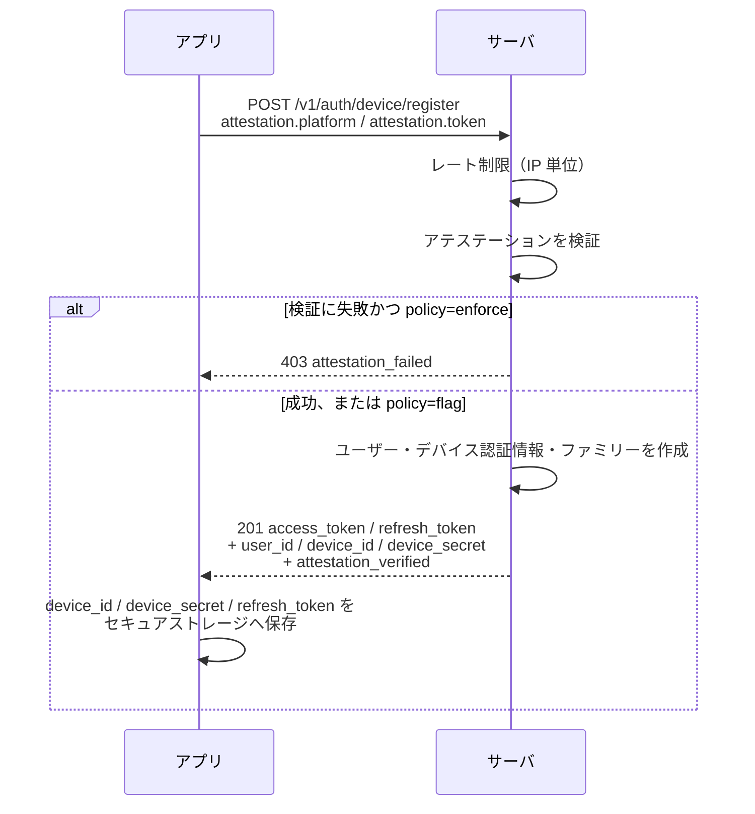
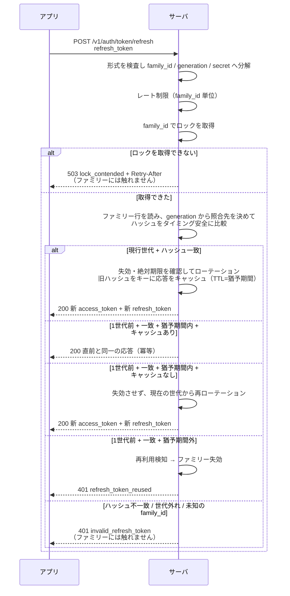
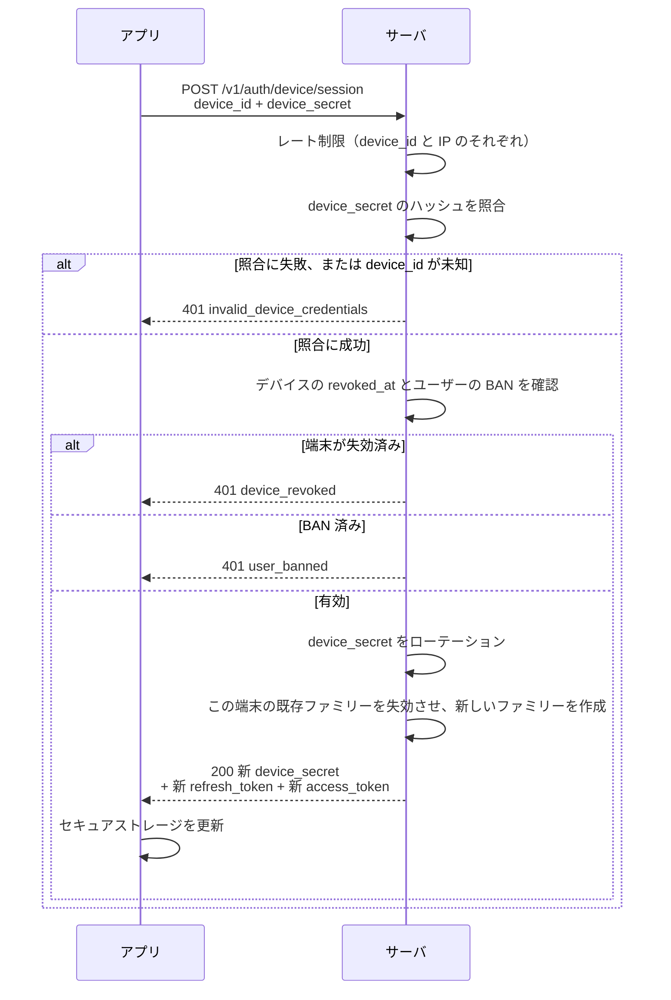

# @igo/server — トークン認証モックサーバ

リポジトリルートの [mobile-game-token-auth-design.md](../../mobile-game-token-auth-design.md)
（以降「設計ドキュメント」、ソース中では `DESIGN N章`）に書かれたモバイルゲーム向けの
3層トークン認証を、REST のモックサーバとして実装したものです。Hono + `@hono/node-server`
で動きます。

**これは本番実装ではありません。** 状態はすべてプロセスのメモリ上にあり、永続化は一切
行いません。JWT の署名鍵も起動のたびに生成するため、**プロセスを再起動すると発行済みの
アクセストークン・リフレッシュトークン・デバイス認証情報はすべて無効になります。**
設計ドキュメントの分岐（グレースピリオド、再利用検知、キャッシュ全断時の方針、鍵の
ローテーション手順）を実際に叩いて確かめるためのものです。

対局成績の永続化など、ゲーム本体のサーバ機能はまだありません（`src/smoke.ts` が
`@igo/core` を素の Node で動かす確認をしているだけです）。

## 起動方法

いずれもリポジトリルートから実行します。

```bash
npm run server:dev     # tsx watch。ソース変更で自動再起動します
npm run server:start   # 一度だけ起動します
npm run test:auth      # 認証モックの検証スイート（ポートは開きません）
```

起動すると、待ち受け URL・`iss` / `aud`・アクセストークンの寿命・猶予期間・管理トークンが
標準出力に出ます。

環境変数で変えられるのは次の3つです。

| 環境変数 | 既定値 | 内容 |
| --- | --- | --- |
| `PORT` | `8787` | 待ち受けポート。正の整数でない場合は起動時に失敗します |
| `AUTH_MOCK_ADMIN_TOKEN` | `mock-admin-token` | `/v1/admin/*` の `X-Admin-Token` に要求する値 |
| `AUTH_MOCK_ATTESTATION` | `enforce` | `flag` を指定したときだけ flag ポリシー、それ以外の値はすべて `enforce` 扱いです |

`AUTH_MOCK_ATTESTATION` は設計ドキュメント5章の「アテステーション失敗時に即拒否するか、
フラグを立てて通すか」に対応します。既定の `enforce` でも、モックのアテステーションは
`invalid-` で始まるトークンだけを失敗にするため、手で叩くぶんには困りません。

これ以外の設定値（期限・レート制限・ロック・キャッシュ障害時の方針）は環境変数では変えられず、
`src/auth/config.ts` の既定値か、`createAuthApp()` に渡す上書きで決まります。

## 3層の構成

設計ドキュメント1章の3層を、このモックの実際の値と対応させると次のとおりです。期限の値は
すべて `src/auth/config.ts` の `defaultAuthConfig` によります。

| 層 | このモックでの実体 | 有効期限 | サーバ側の状態 |
| --- | --- | --- | --- |
| アクセストークン | JWT（HS256、`kid` 付き）。クレームは `sub` / `iss` / `aud` / `iat` / `exp` / `fid` / `tv` / `jti` | 900秒（15分）。検証時の leeway は 60秒 | 持ちません。`token_version` の参照のみ行います |
| リフレッシュトークン | 不透明値 `rt_{family_id}.{generation}.{secret}` | 30日（絶対期限のみ。ローテーションしても延びません） | ファミリー1行。`secret_hash` と `prev_secret_hash` を SHA-256 で保持します |
| デバイス認証情報 | `device_id` + `device_secret`（32バイトのランダム値の base64url） | 失効するまで。サイレント再ログインのたびにローテーションします | デバイス1行。`secret_hash` のみ保持します |

そのほかの既定値です。

| 項目 | 既定値 |
| --- | --- |
| `iss` / `aud` | `https://auth.igo.example` / `igo-api` |
| ローテーション直後の猶予期間 | 30秒 |
| ロック | TTL 5,000ms / 取得タイムアウト 3,000ms / `Retry-After` 1秒 |
| レート制限 | デバイス登録 10回/60秒（IP 単位）、リフレッシュ 30回/60秒（`family_id` 単位）、サイレント再ログイン 10回/60秒（`device_id` と IP のそれぞれ） |
| アテステーション方針 | `enforce` |
| キャッシュ全断時の方針 | `database-fallback`（`fail-open` 時の許容上限は5分） |
| 再利用検知時にデバイス認証情報も失効させるか | `false` |
| 署名鍵 | 起動時に `kid=v1` の HS256 鍵（32バイト）を生成します |

## エンドポイント一覧

エラー応答はすべて `{"error":{"code":"...","message":"..."}}` の形です。

| メソッド | パス | 認証 | 用途 |
| --- | --- | --- | --- |
| `GET` | `/healthz` | 不要 | 死活確認。`{"status":"ok"}` を返します |
| `POST` | `/v1/auth/device/register` | 不要（アテステーション） | 初回登録。ユーザー・デバイス認証情報・ファミリーを新規作成します（201） |
| `POST` | `/v1/auth/token/refresh` | ボディのリフレッシュトークン | ローテーションして新しいトークン一式を返します（200） |
| `POST` | `/v1/auth/device/session` | ボディのデバイス認証情報 | サイレント再ログイン。`device_secret` を回し、新しいファミリーを作ります（200） |
| `POST` | `/v1/auth/logout` | `Authorization: Bearer` | この端末（`fid` のファミリー）だけログアウトします（204） |
| `POST` | `/v1/auth/logout-all` | `Authorization: Bearer` | 全端末ログアウト。`token_version` を上げるので即時に効きます（200） |
| `GET` | `/v1/me` | `Authorization: Bearer` | 保護エンドポイントの例。クレームから引ける範囲を返します（200） |

`/v1/admin/*` は**モック運用専用**です。本番の API ではありません。設計ドキュメント7章
（失効、`token_version` のキャッシュ全断時の方針）・11章（鍵ローテーション、定期掃除、
監査ログ）・4章（猶予期間用キャッシュの消失）の挙動は、外から起こせないと確かめようが
ないため用意してあります。すべて `X-Admin-Token` ヘッダが
必要で、一致しなければ 403 `forbidden` です。

| メソッド | パス | 用途 |
| --- | --- | --- |
| `POST` | `/v1/admin/users/:userId/ban` | BAN。`token_version` の更新・全ファミリー失効・全デバイス失効をまとめて行います（204） |
| `POST` | `/v1/admin/users/:userId/logout-all` | 全端末ログアウト（200、`{"revoked_families":N}`） |
| `POST` | `/v1/admin/devices/:deviceId/revoke` | 端末の永久遮断。再ログインの入口を塞ぎます（204） |
| `GET` | `/v1/admin/users/:userId` | ユーザー・デバイス・ファミリーの状態確認。ハッシュは出しません（200） |
| `GET` | `/v1/admin/keys` | 鍵の一覧（`kid` / `alg` / `active`）。鍵そのものは出しません（200） |
| `POST` | `/v1/admin/keys` | 手順1。`{"kid":"v2"}` で新しい鍵を検証側にだけ配ります（201） |
| `POST` | `/v1/admin/keys/:kid/promote` | 手順3。署名鍵を切り替えます（200） |
| `DELETE` | `/v1/admin/keys/:kid` | 手順5。旧鍵を検証側から外します。署名中の鍵は外せません（200） |
| `POST` | `/v1/admin/cache/outage` | `{"available":false}` でキャッシュ全断を再現します（200、`{"cache_available":false}`） |
| `POST` | `/v1/admin/cache/flush` | 猶予期間用キャッシュが飛んだ状況を再現します（204） |
| `POST` | `/v1/admin/maintenance/purge` | 期限切れ・放置ファミリーの定期掃除（200、`{"purged_families":N}`） |
| `GET` | `/v1/admin/audit?limit=N` | 監査ログを新しい順に返します（200）。`limit` は正の整数のみです |

応答のフィールド名は全エンドポイントで snake_case、時刻は ISO 8601 文字列に統一しています。
内部モデルは camelCase / epoch ミリ秒で、変換は `src/http/present.ts` だけで行います。

## 主要フロー

### 初回登録



### リフレッシュ

ファミリーの失効に至る分岐は、いずれも**ハッシュ照合を通った場合だけ**です。



### サイレント再ログイン



> このモックは「1端末につきセッション1つ」という方針を取り、サイレント再ログイン時に
> 同じ端末の既存ファミリーを畳みます。設計ドキュメントには明記がない、モック固有の判断です。

## リクエスト・レスポンス例

以下は既定ポートで起動した場合の例です。トークンは長いので途中を省略しています。

### デバイス登録

```bash
BASE=http://localhost:8787

curl -s -X POST "$BASE/v1/auth/device/register" \
  -H 'content-type: application/json' \
  -d '{"attestation":{"platform":"ios","token":"attest-ok"},"device_hint":"iPhone16,2"}'
```

```json
{
  "access_token": "eyJ0eXAiOiJKV1QiLCJhbGciOiJIUzI1NiIsImtpZCI6InYxIn0...",
  "refresh_token": "rt_Zyv7nKpTTd0-W4DSIiADdw.0.vmmuBoX5lexUQAp7WC61...",
  "token_type": "Bearer",
  "expires_in": 900,
  "family_id": "Zyv7nKpTTd0-W4DSIiADdw",
  "refresh_token_expires_at": "2026-10-17T01:47:51.448Z",
  "user_id": "NygEk-Pc-z6IUMtZEfsTFg",
  "device_id": "B-KjcdWS6RTxf-NMt6EpBA",
  "device_secret": "CU0ptrN0r_M-Za8zh4xQgAMngXc8QWoa-uvCVqJeewY",
  "attestation_verified": true
}
```

`attestation.platform` は `"ios"` または `"android"` のみです。`attestation.token` が空文字か
`invalid-` で始まる場合はアテステーション失敗として扱われ、`enforce` なら 403
`attestation_failed` になります。`device_hint` は省略可能で、認証には使いません。

平文の `device_secret` がネットワークに流れるのはこの応答とサイレント再ログインの応答だけです。

### リフレッシュ

```bash
curl -s -X POST "$BASE/v1/auth/token/refresh" \
  -H 'content-type: application/json' \
  -d '{"refresh_token":"rt_Zyv7nKpTTd0-W4DSIiADdw.0.vmmuBoX5lexUQAp7WC61..."}'
```

```json
{
  "access_token": "eyJ0eXAiOiJKV1QiLCJhbGciOiJIUzI1NiIsImtpZCI6InYxIn0...",
  "refresh_token": "rt_Zyv7nKpTTd0-W4DSIiADdw.1.m2icJoZAR8BVdifqii_d...",
  "token_type": "Bearer",
  "expires_in": 900,
  "family_id": "Zyv7nKpTTd0-W4DSIiADdw",
  "refresh_token_expires_at": "2026-10-17T01:47:51.448Z"
}
```

`family_id` は変わらず `generation` だけが進みます。`refresh_token_expires_at` は絶対期限
なので、ローテーションしても延びません。同じリクエストを30秒以内にもう一度送ると、
まったく同じ応答が返ります（猶予期間による冪等な応答）。

### サイレント再ログイン

```bash
curl -s -X POST "$BASE/v1/auth/device/session" \
  -H 'content-type: application/json' \
  -d '{"device_id":"B-KjcdWS6RTxf-NMt6EpBA","device_secret":"CU0ptrN0r_M-Za8zh4xQgAMngXc8QWoa-uvCVqJeewY"}'
```

```json
{
  "access_token": "eyJ0eXAiOiJKV1QiLCJhbGciOiJIUzI1NiIsImtpZCI6InYxIn0...",
  "refresh_token": "rt_wlzVP4o02P4prKpDK10oAg.0.VzBYwz1jYki3FB6wa1NR...",
  "token_type": "Bearer",
  "expires_in": 900,
  "family_id": "wlzVP4o02P4prKpDK10oAg",
  "refresh_token_expires_at": "2026-10-17T01:48:02.284Z",
  "user_id": "NygEk-Pc-z6IUMtZEfsTFg",
  "device_id": "B-KjcdWS6RTxf-NMt6EpBA",
  "device_secret": "fzcDGgwOzpezeYf4gJZtKvVsirS94fTNbCh72J4dUO4"
}
```

`device_secret` は毎回変わります。**クライアントは必ず保存し直してください。**
`family_id` も新しい値になります。

### 保護エンドポイント

```bash
curl -s "$BASE/v1/me" -H "Authorization: Bearer eyJ0eXAiOiJKV1Qi..."
```

```json
{
  "user_id": "NygEk-Pc-z6IUMtZEfsTFg",
  "family_id": "Zyv7nKpTTd0-W4DSIiADdw",
  "token_version": 1,
  "active_sessions": 1,
  "access_token_expires_at": "2026-09-17T02:02:51.000Z"
}
```

トークンを受け取るのは `Authorization: Bearer` ヘッダだけです。`?access_token=...` のような
クエリ文字列は見ません（設計ドキュメント10章）。ヘッダが無い場合は 401
`missing_access_token` です。

### 管理エンドポイントの例

```bash
curl -s "$BASE/v1/admin/keys" -H 'X-Admin-Token: mock-admin-token'
# {"keys":[{"kid":"v1","alg":"HS256","active":true}]}

curl -s "$BASE/v1/admin/users/NygEk-Pc-z6IUMtZEfsTFg" -H 'X-Admin-Token: mock-admin-token'
# {
#   "user_id": "NygEk-Pc-z6IUMtZEfsTFg",
#   "token_version": 1,
#   "banned_at": null,
#   "devices": [
#     { "device_id": "...", "attestation_verified": true,
#       "last_login_at": "2026-09-17T01:54:19.809Z", "revoked_at": null }
#   ],
#   "families": [
#     { "family_id": "...", "device_id": "...", "generation": 0,
#       "rotated_at": "2026-09-17T01:54:19.809Z",
#       "absolute_expires_at": "2026-10-17T01:54:19.809Z", "revoked_at": null }
#   ]
# }

curl -s "$BASE/v1/admin/audit?limit=2" -H 'X-Admin-Token: mock-admin-token'
# {"records":[{"at":"2026-09-17T01:54:19.809Z","event":"device_registered",
#              "user_id":"...","family_id":"...","device_id":"...",
#              "ip":"unknown","user_agent":"curl/8.7.1","detail":null}]}
# 監査ログにトークンそのものは含まれません（設計ドキュメント11章）。
```

## リフレッシュの判定ロジック

設計ドキュメント4章の表を、このモックの実装（`src/auth/authService.ts` の
`rotateUnderLock`）に対応させたものです。

**大前提として、ファミリーの失効はハッシュ検証を通った場合にのみ行います。**
`family_id` は JWT の `fid` クレームから誰でも読め、`generation` も小さい整数なので
推測できます。検証なしに失効させる実装にすると、アクセストークンを一度観測した第三者が
`{既知の family_id}.{推測した generation}.{デタラメ}` を送るだけで、任意のユーザーを
全端末ログアウトさせられます。下の表で「ファミリー失効」に至る行が、いずれもハッシュ一致を
前提にしている点が要です。

| 受け取った `generation` | ハッシュ照合 | 追加条件 | 動作 | HTTP レスポンス |
| --- | --- | --- | --- | --- |
| 現在値と一致 | `secret_hash` と**一致** | 失効しておらず絶対期限内 | 通常のローテーション。旧ハッシュをキーに応答をキャッシュします | 200 トークン一式 |
| 現在値と一致 | **一致** | `revoked_at` あり | ファミリーは失効済み | 401 `family_revoked` |
| 現在値と一致 | **一致** | 絶対期限切れ | サイレント再ログインへ進む合図 | 401 `refresh_token_expired` |
| 現在値 − 1 | `prev_secret_hash` と**一致** | 猶予期間内（`now - rotated_at ≦ 30秒`）でキャッシュが生きている | 直前の応答をそのまま返します（冪等） | 200 直前と同一のトークン一式 |
| 現在値 − 1 | **一致** | 猶予期間内だがキャッシュが無い | **失効させず**、現在の世代からもう一度ローテーションします | 200 新しいトークン一式 |
| 現在値 − 1 | **一致** | 猶予期間外 | 再利用検知 → ファミリー失効（`revokeDeviceOnReuseDetection` が true ならデバイスも失効） | 401 `refresh_token_reused` |
| 現在値より新しい | 照合対象なし | — | 拒否のみ。ファミリーには触れません | 401 `invalid_refresh_token` |
| 2世代以上古い | 照合対象なし | — | 拒否のみ。ファミリーには触れません | 401 `invalid_refresh_token` |
| いずれの世代でも | **不一致** | — | 拒否のみ。ファミリーには触れません | 401 `invalid_refresh_token` |
| `family_id` が存在しない | — | — | 拒否のみ | 401 `invalid_refresh_token` |
| 形式不正（`rt_` 接頭辞なし、要素数違い、`generation` が非負10進整数でない） | — | — | 拒否のみ。ロックも取りません | 401 `invalid_refresh_token` |

猶予期間内でも、失効・絶対期限の確認はハッシュ照合の**後**に行います。先に確認すると、
シークレットを持たない相手に「その `family_id` は生きているか」を教えることになります。

拒否だけの行がすべて同じ `invalid_refresh_token` に潰してあるのも同じ理由です。応答から
`family_id` の存在有無すら読み取れないようにしています。判別に必要な情報は監査ログ
（`refresh_rejected`）に残ります。

なお、ロックを取得できなかった場合はファミリーに触れず 503 `lock_contended` +
`Retry-After` を返します。競合はエラーであって攻撃ではないためです。

## エラーコードとクライアントの振る舞い

| コード | HTTP | 発生する場面 | クライアントの動作 |
| --- | --- | --- | --- |
| `invalid_request` | 400 | ボディが JSON オブジェクトでない、必須フィールドが無い・型が違う | 実装のバグです。再試行しません |
| `invalid_request` | 404 | 管理エンドポイントで対象のユーザー・端末が存在しない | 同上 |
| `not_found` | 404 | 存在しないパス | 同上 |
| `attestation_failed` | 403 | `enforce` でアテステーションに失敗 | 同じ環境で再試行しても結果は変わりません |
| `forbidden` | 403 | `X-Admin-Token` 不一致、他人のファミリーへのログアウト | 同上 |
| `missing_access_token` | 401 | `Authorization: Bearer` が無い | 実装のバグです |
| `invalid_access_token` | 401 | 署名不正、未知の `kid`、形式不正、`iss` / `aud` 不一致、`iat` が未来すぎる | リフレッシュを1回だけ挟んで再実行し、それでも 401 なら諦めます |
| `access_token_expired` | 401 | `exp + leeway` を過ぎた | 同上 |
| `token_version_mismatch` | 401 | BAN / 全端末ログアウトで `token_version` が上がった | 同上。リフレッシュも失敗するはずなので、最終的にログイン状態を破棄します |
| `invalid_refresh_token` | 401 | 判定ロジック表の「拒否のみ」の行 | サイレント再ログインを**1回だけ**試みます |
| `refresh_token_expired` | 401 | 絶対期限（30日）を過ぎた | 同上 |
| `refresh_token_reused` | 401 | 猶予期間外の旧トークン（再利用検知） | 同上 |
| `family_revoked` | 401 | ログアウト・BAN・再利用検知で失効済み | 同上 |
| `invalid_device_credentials` | 401 | `device_id` が未知、`device_secret` 不一致 | **再試行せず、ログイン状態を破棄してユーザーに提示します** |
| `device_revoked` | 401 | 端末が永久遮断された | 同上 |
| `user_banned` | 401 | ユーザーが BAN された | 同上 |
| `rate_limited` | 429 | レート制限の超過。`Retry-After` にウィンドウ幅が入ります | 指数バックオフで再試行します。**認証情報は破棄しません** |
| `lock_contended` | 503 | `family_id` のロックを取得できなかった。`Retry-After: 1` | `Retry-After` に従って再試行します。**認証情報は破棄しません** |
| `token_version_unavailable` | 503 | キャッシュ全断で `token_version` を検証しきれない（`fail-open` の上限超過・`fail-closed`）。`Retry-After: 5` | 同上 |
| `internal_error` | 500 | 想定外の例外。サーバ側の不具合です | 設計ドキュメントに規定はありませんが、401 ではないので認証情報は破棄しません |

**401 と 429 / 503 の違いが、この設計でもっとも取り違えやすい点です。**

- **401 は「その認証情報はもう通らない」という意味です。** クライアントは次の層
  （リフレッシュ → サイレント再ログイン）へ進み、最後の層も 401 なら認証情報を破棄して
  ユーザーに提示します。
- **429 / 503 はサーバ都合の一時的な事情です。** 認証情報は有効なままなので、破棄しては
  いけません。`Retry-After` に従って再試行します。ここを 401 と同じに扱うと、キャッシュ障害や
  ロック競合といったサーバ側の一時障害で全ユーザーが強制ログアウトになります。
  キャッシュ全断時に 401 ではなく 503 `token_version_unavailable` を返しているのは、
  まさにこのためです。

401 応答には `WWW-Authenticate: Bearer error="<コード>"` が付きます。429 / 503 には
`Retry-After` が付きます。

**「401 → リフレッシュ → 再実行」を無制限に繰り返す実装にしないでください。** サーバ側の
失効と噛み合うと、無限ループでリフレッシュエンドポイントを叩き続けます。再実行は1回までです。

## モックである点 / 実装していないこと

| 項目 | このモックでの扱い |
| --- | --- |
| 永続化 | ありません。永続DB相当（`store.ts`）も揮発キャッシュ相当（`cache.ts`）も `Map` です。両者はコード上では明確に分けてあり、「永続DBには `secret_hash` しか置かない」という原則は検証できます |
| 署名鍵 | 起動時に `kid=v1` の HS256 鍵を生成します。シークレットマネージャからの読み込みはありません。**再起動で全トークンが無効になります** |
| アテステーション | 形式だけのモックです。空文字と `invalid-` で始まるトークンを失敗、それ以外を成功とします。App Attest / Play Integrity の署名検証は行いません |
| 分散ロック | プロセス内の `InMemoryLock` です。複数プロセスで動かすとロックが効きません |
| キャッシュ | プロセス内です。Redis 等の外部ストアは使いません。全断は `/v1/admin/cache/outage` で再現します |
| TLS | 張りません。設計ドキュメント10章のとおり平文で `device_secret` が流れるため、リバースプロキシで TLS を終端する前提です |
| 接続元 IP | `x-forwarded-for` / `x-real-ip` をそのまま読みます。信頼できるプロキシの前提を置いていないため、レート制限は簡単に迂回できます |
| 監査ログ | メモリに直近500件を保持し、標準出力へ出します。外部への送出や異常検知はありません |
| アルゴリズム | HS256 のみです。`kid` から鍵とアルゴリズムを引く構造は用意してあるので、ES256 を足す場所は `jwt.ts` の1箇所です |
| ゲーム機能 | ありません。対局成績の保存も、`@igo/core` を使った対局 API もまだありません |

設計ドキュメントの章ごとの対応です。

| 章 | 状況 |
| --- | --- |
| 1章 全体構成 | 実装済み。3層をそのまま実装しています |
| 2章 アクセストークン | 実装済み。HS256、`kid` から鍵とアルゴリズムを引き `alg` ヘッダは見ません。leeway 60秒 |
| 3章 リフレッシュトークン | 実装済み。`rt_{family_id}.{generation}.{secret}` 形式、SHA-256 保存、タイミング安全な比較、絶対期限のみ。「起動ごとの書き込み量」の緩和策（ローテーションの間引き等）は入れていません |
| 4章 ローテーションと再利用検知 | 実装済み。猶予期間・応答キャッシュ・ダブルチェック・`family_id` 単位のロックまで。ただしロックはプロセス内です。保持世代は `prev_secret_hash` の1世代のみ（N世代の配列保持は未対応） |
| 5章 デバイス認証情報 | 実装済み。ただしアテステーションはモックです。機種変・端末故障の救済（外部ID連携・引き継ぎコード）は未対応です |
| 6章 認証フロー | 実装済み。4つのフローがそのままエンドポイントになっています |
| 7章 失効の設計 | 実装済み。`token_version`、ファミリー失効、デバイス失効、BAN、キャッシュ障害時の3方針すべて |
| 8章 サービス分割への備え | 未対応。`aud` は単一値、公開鍵方式も未実装です。`kid` レジストリと「認証ロジックを1箇所に閉じる」構造だけ用意してあります |
| 9章 セッション変数の置き換え | 未対応。ゲーム側の状態がまだないため、`family_id` をキーにした置き場の実装はありません。揮発キャッシュに何を置いてよいかの線引きは `cache.ts` のコメントに残してあります |
| 10章 通信路とクライアント実装 | サーバ側のみ実装済み（`Authorization` ヘッダ限定、レート制限、ログにトークンを出さない）。TLS・証明書ピンニング・クライアント実装は範囲外です |
| 11章 鍵管理と運用 | 鍵ローテーション手順・定期掃除・監査ログは `/v1/admin/*` から実行できます。シークレットマネージャからの鍵読み込みは未対応です |
| 12章 実装チェックリスト | 「テスト」の項目を `npm run test:auth` で自動化しています |

## ディレクトリ構成

```
src/
  index.ts                 起動エントリ。環境変数の読み取りとポートの待ち受け
  auth/                    ドメイン層。HTTP を一切知りません
    config.ts              設定と既定値
    authService.ts         認証の中核（登録・リフレッシュ・再ログイン・検証・失効）
    store.ts               永続DB相当のインメモリストア
    cache.ts               揮発キャッシュ相当。全断の再現もここ
    jwt.ts                 アクセストークンの発行と検証
    keys.ts                kid → 鍵のレジストリ
    refreshToken.ts        リフレッシュトークンの形式
    attestation.ts         端末アテステーション（モック）
    lock.ts                family_id 単位のロック
    rateLimit.ts           固定ウィンドウのレート制限
    crypto.ts              ランダム値・SHA-256・タイミング安全な比較
    clock.ts               時刻の注入口
    errors.ts              エラーコードと HTTP ステータス
    audit.ts               監査ログ
    authMock.test.ts       検証スイート（npm run test:auth）
  http/                    HTTP 層。ドメイン層を呼んで JSON に整形するだけです
    app.ts                 依存の組み立てとエラーハンドリング
    bearerAuth.ts          アクセストークン検証ミドルウェア
    body.ts                リクエストボディの検証
    present.ts             内部モデル（camelCase）→ ワイヤ（snake_case）の変換
    env.ts                 Hono のコンテキスト型と接続元情報
    routes/                auth.ts / me.ts / admin.ts
  smoke.ts                 @igo/core が素の Node で動くことの確認（認証とは無関係）
```

`src/auth/authMock.test.ts` は `packages/core` の `spike.test.ts` と同じ手書きの
アサーションハーネスで、失敗すると throw して非ゼロ終了します。ポートは開かず
Hono の `app.request()` を直接叩くため、サーバを起動せずに実行できます。時計と
キャッシュを注入して、猶予期間の境界・絶対期限超過・ロック競合・キャッシュ全断・
鍵のローテーション・`alg` すり替えといった、目視では踏めない分岐を固めています。

`tsx` は型検査をしないため、`npm run typecheck` も併せて実行してください。
