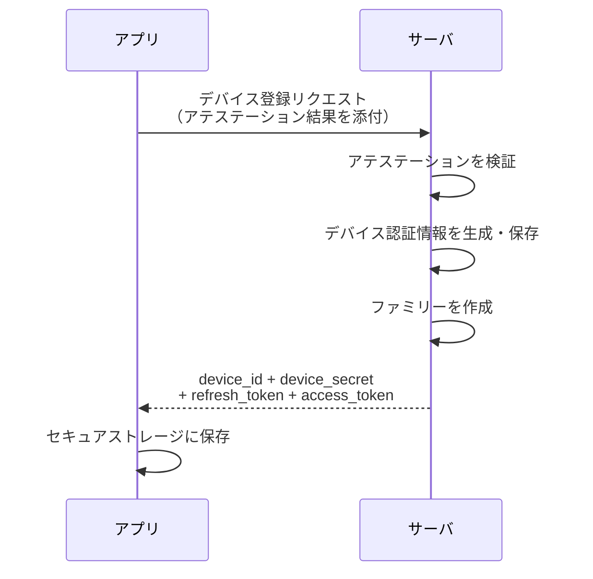
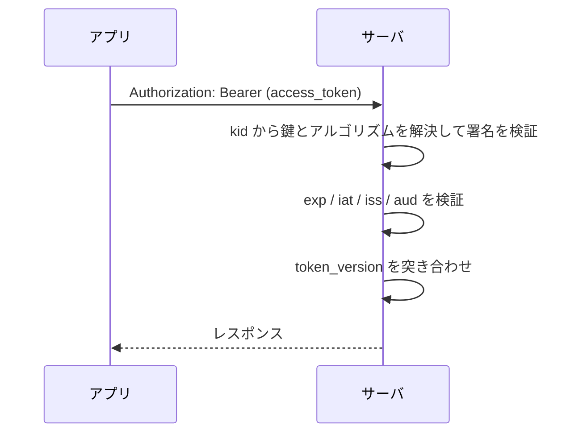
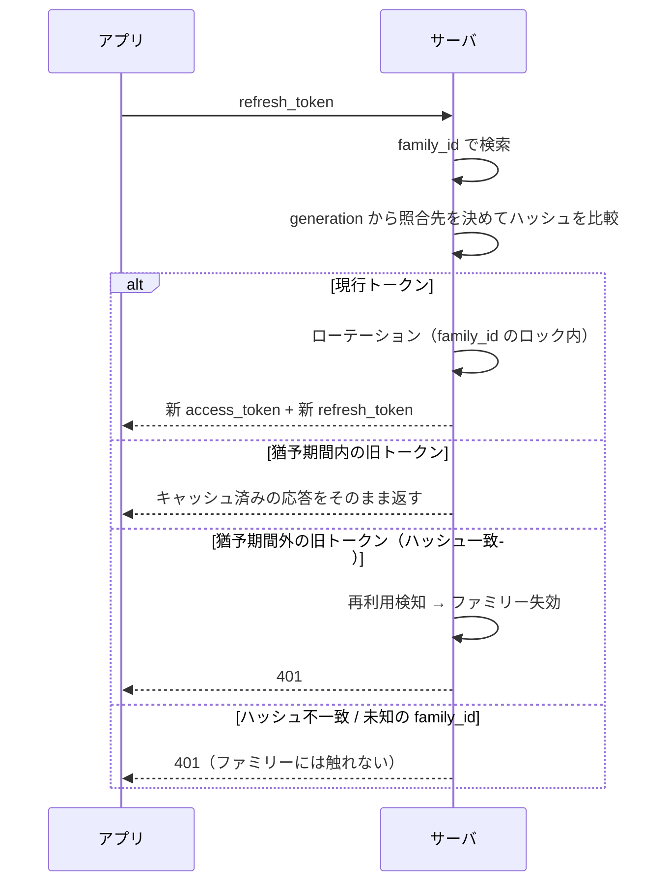
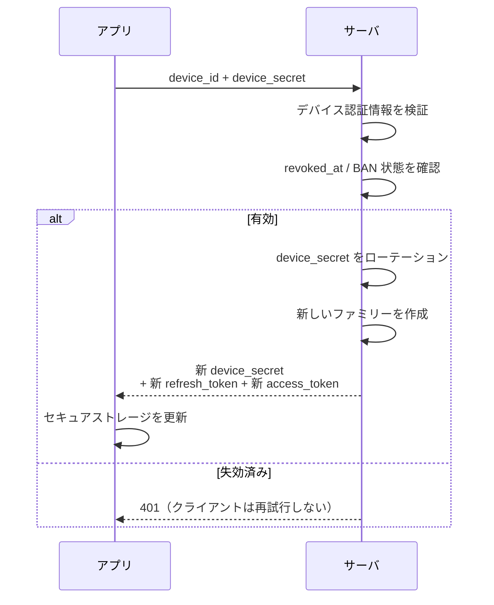

# モバイルゲーム向けトークン認証 設計ドキュメント

言語・フレームワーク非依存の設計方針をまとめたものです。
対象は「自社アプリ ⇔ 自社サーバ」のファーストパーティ構成です。

---

## 1. 全体構成

認証情報を寿命の異なる3層に分割します。

| 層 | 実体 | 有効期限 | 保存場所（クライアント） | サーバ側の状態 |
|---|---|---|---|---|
| アクセストークン | JWT（自己完結型） | 15〜30分 | メモリのみ | 持たない |
| リフレッシュトークン | 不透明なランダム値 | 30日（絶対期限） | セキュアストレージ | ファミリー1行 |
| デバイス認証情報 | ID + ランダムシークレット | 失効するまで | セキュアストレージ | 1行 |

### 層を分ける理由

- **アクセストークンの検証を軽くする** → 毎リクエストでDBを引かずに検証できます
- **リフレッシュトークンで失効の粒度を得る** → セッション（端末）単位でログアウトさせられます
- **デバイス認証情報をネットワークに流す回数を減らす** → 長期クレデンシャルの露出を、初回とリフレッシュ期限切れ時のみに限定します

2層構成（デバイス認証情報 + セッショントークン）でも成立はしますが、
「セッション単位の失効」と「長期クレデンシャルの露出頻度」を犠牲にします。

> **「ステートレス」の但し書き**
>
> 7章の `token_version` だけは毎リクエストで参照します。したがって厳密なステートレスではなく、
> **「失効を効かせるためのキャッシュ参照1回だけを残し、それ以外の状態は持たない」**構成です。
> セッションの読み書きと永続DBへの問い合わせが毎リクエストから消えることが利点であり、
> 状態がゼロになるわけではありません。

---

## 2. アクセストークン（JWT）

### 署名アルゴリズム

**単一サービス構成なら HS256（HMAC-SHA256）で十分です。**

選択基準は性能ではなく鍵の配り方です。

| アルゴリズム | 検証コスト（目安） | 性質 |
|---|---|---|
| HS256 | 1μs 未満 | 共有鍵。検証できる = 偽造できる |
| RS256 | 数十μs | 署名が重く検証が軽い |
| ES256 | 数十μs | 署名が軽く検証が重い |
| EdDSA | 数十μs | バランス型 |

桁は違いますが絶対値は小さく、仮に30μsでも15,000 RPSでCPU 0.5コア相当にしかならないため、
アプリケーションフレームワークのオーバーヘッドに埋もれます。

**公開鍵方式に切り替えるべきなのは、検証する側が増えたときです。**
HMACは検証鍵と署名鍵が同一なので、検証させたいだけのコンポーネントに
署名能力まで渡すことになります（→ 8章）。

### クレーム設計

サイズが全リクエストの帯域に効くため最小限にします。

| クレーム | 内容 | 必須 |
|---|---|---|
| `sub` | ユーザーID | ○ |
| `exp` | 有効期限 | ○ |
| `iat` | 発行時刻 | ○ |
| `iss` | 発行者識別子 | ○（当面は単一値でよい） |
| `aud` | 宛先サービス識別子 | ○（当面は単一値でよい） |
| `kid` | 署名鍵ID（ヘッダ） | ○ |
| `fid` | ファミリーID（= デバイスセッションID） | ○ |
| `tv` | token_version | ○ |
| `jti` | トークン固有ID | 任意 |

> **`iss` / `aud` / `kid` は最初から入れておきます。**
> 後から必須化すると、旧トークンが自然消滅するまでの移行期間が必要になり面倒です。

> **`fid` は秘密情報ではありません。** JWTのペイロードは署名されているだけで
> 暗号化されていないため、Base64デコードで誰でも読めます。つまり
> **アクセストークンを一度観測した相手には `family_id` が既知になる**という前提で
> サーバ側を設計する必要があります（→ 4章）。

### 検証手順（毎リクエスト）

1. **`kid` から署名鍵とアルゴリズムの両方を引きます。`alg` ヘッダは参照しません**
   - 未知の `kid` は即座に拒否します
   - 鍵とアルゴリズムを1対1で対応づけることで、`alg: none` や RS→HS すり替えの経路が構造的に塞がります
   - 8章の HS256 → ES256 移行でも、鍵ごとにアルゴリズムが決まるため「許可アルゴリズムを固定する」原則と両立します
2. 手順1で決まったアルゴリズムと鍵で署名を検証します
3. `exp` / `iat` を検証します。端末の時計ずれ用に数十秒の leeway を許容します
4. `iss` / `aud` が自サービス宛か確認します
5. `tv` を現在の `token_version` と突き合わせます（→ 7章）

> **手順1と2の順序が重要です。**
> 先に署名を検証してからアルゴリズムを確認する実装は、検証時点で `alg` ヘッダを
> 信用していることになり、すり替え攻撃を防げません。

### 禁止事項

- **ペイロードに秘匿情報を入れません。** 署名されているだけで暗号化されていません。Base64デコードで誰でも読めます
- **`alg` を検証時に動的採用しません。** `alg: none` や RS→HS すり替えの経路になります
- **トークンをURLのクエリ文字列に載せません。** アクセスログやプロキシに残ります（→ 10章）

---

## 3. リフレッシュトークン

### 形式

**JWTにしません。** 失効させたいものを自己完結型にする意味がないためです。
128bit以上のランダム値を使い、サーバ側に状態を持ちます。

```
{family_id}.{generation}.{random_secret}
     ↑            ↑             ↑
  検索キー     世代判定    ハッシュ化して比較
```

この構造にすることで、**照合すべきハッシュを O(1) で特定できます。**

> 区切り文字が JWT と同じ `.` なので、`family_id` と `generation` には
> `.` を含まない表現（UUID / base64url / 10進数）を前提にします。
> ログや問い合わせで JWT と混同されないよう、接頭辞（`rt_` など）を付けておくと安全です。

### サーバ側のデータモデル

ファミリー（= 端末セッション）ごとに1行のみです。

| カラム | 用途 |
|---|---|
| `family_id` | 主キー。トークンから直接引ける |
| `user_id` | ユーザー単位の全端末ログアウト用 |
| `device_id` | 発行元のデバイス認証情報 |
| `generation` | 現在の世代番号 |
| `secret_hash` | 現行シークレットの SHA-256 |
| `prev_secret_hash` | 1世代前。グレースピリオド用 |
| `rotated_at` | 最終ローテーション時刻 |
| `absolute_expires_at` | 絶対有効期限（天井） |
| `revoked_at` | 失効時刻 |
| `last_used_at` | 放置端末の掃除用 |

**行数は「リフレッシュ回数」ではなく「端末数」に比例します。**
ユーザーあたり1〜数行にしかならないため、永続DBに素直に置けます。

保存はハッシュ化した値のみです。ランダム値なので SHA-256 で十分で、
パスワードではないため bcrypt 等は不要です。
比較は必ず **タイミング安全な比較関数** を使います。

### 保存先

**永続DBに置きます。** 揮発ストア（Redis系）のみだと、飛んだ瞬間に全ユーザーが再ログインになります。

### 起動ごとのリフレッシュと書き込み量

アクセストークンをメモリのみに保持する構成のため、
**アプリのコールドスタートごとに必ずリフレッシュが1回走ります。**
ローテーションを伴うので、これは読み取りではなく**永続DBへの書き込み**です。

つまり書き込みQPSは「起動数 + アクセストークン期限切れ分」に比例します。
DAUが大きいタイトルでは無視できない量になるため、緩和策を先に決めておきます。

| 緩和策 | 内容 | トレードオフ |
|---|---|---|
| 何もしない | 起動ごとにローテーションする | 実装が最も単純。規模が小さいうちはこれで十分 |
| アクセストークンも保存する | セキュアストレージに置き、`exp` までは再利用する | 起動時のリフレッシュ自体が減る。アクセストークンの露出面が増える |
| ローテーションを間引く | 前回ローテーションから一定時間内なら現行トークンをそのまま返す | 書き込みが激減する。再利用検知の精度が下がる |

### 有効期限

**絶対有効期限のみとし、スライディング更新は行いません。**

ローテーションはサイレントに行われるため、スライド更新がなくてもユーザー体験は変わりません。
期限を1本にすることで、天井が2系統ある状態を避けられます。

ローテーション時は `absolute_expires_at` をそのまま引き継ぎます。

> スライディング更新を採用する場合は、**必ず絶対上限を併設します**（例: スライド30日 / 上限180日）。
> スライドのみだと、アクティブユーザーのトークンが実質永続化し、盗まれた場合に永久に使われます。

---

## 4. ローテーションと再利用検知

### 基本方針

リフレッシュのたびに新しいリフレッシュトークンを発行し、旧トークンを無効化します。
**無効化済みトークンが再度使われたら、そのファミリー全体を失効させます。**

現行トークンだけを失効させても、ローテーション済みでクライアントにキャッシュされた
トークンを攻撃者に使われうるため、ファミリー単位で潰す必要があります。

### 大前提: ファミリー失効はシークレットを確認できた場合のみ

**ファミリーの失効は、受け取ったトークンが正規のシークレットであると
暗号学的に確認できた場合に限って行います。**

`family_id` は秘密情報ではありません。JWTの `fid` クレームに入っており、
JWTのペイロードは Base64 デコードで誰でも読めます。`generation` も小さい整数なので推測できます。

したがって、ハッシュ検証を通らないリクエストでファミリーを失効させる実装にすると、
**アクセストークンを一度観測した第三者が、`{既知のfamily_id}.{推測したgeneration}.{デタラメ}` を
送るだけで、任意のユーザーを全端末ログアウトさせられます。**

ハッシュ不一致は世代によらず「不正リクエストとして拒否」のみとし、ファミリーには触れません。

### 判定ロジック

| 受け取った `generation` | ハッシュ照合 | 追加条件 | 動作 |
|---|---|---|---|
| 現在値と一致 | `secret_hash` と**一致** | — | 通常のローテーション |
| 現在値 − 1 | `prev_secret_hash` と**一致** | 猶予期間内 | 直前の応答をそのまま返す（冪等） |
| 現在値 − 1 | `prev_secret_hash` と**一致** | 猶予期間外 | 再利用検知 → ファミリー失効 |
| 現在値より新しい | 照合対象なし | — | 拒否のみ。ファミリーには触れない |
| 2世代以上古い | 照合対象なし | — | 拒否のみ。ファミリーには触れない |
| いずれの世代でも | **不一致** | — | 拒否のみ。ファミリーには触れない |
| `family_id` が存在しない | — | — | 拒否のみ |

**ファミリー失効に至る行が、いずれもハッシュ一致を前提にしている点が要です。**

### 保持する世代数と検知できる範囲

`prev_secret_hash` を1つ持つ構成では、**照合できるのは現在世代と1つ前だけ**です。
2世代以上古いトークンは照合対象がないため、正規の古いトークンなのか
無関係なランダム値なのかを**区別できません。** 前節の原則に従い、拒否のみとします。

これは検知漏れではありますが、失われるのは**攻撃を検知してユーザーを守る機会**であって、
攻撃者がそのトークンを使えるようになるわけではありません（無効なものは無効です）。
補うには次のどちらかを取ります。

- **直近N世代のハッシュを配列で保持します。** 行数は増えず、N世代前までの再利用を検知できます
- 拒否そのものを監査ログとレート制限の対象にし、頻度で異常を判断します（→ 11章）

つまり世代番号の役割は「古いトークンをすべて未知の値と区別する」ことではなく、
**照合すべきハッシュがどれかを O(1) で特定すること**です。

### グレースピリオド（猶予期間）

**これを入れないと、正規ユーザーが高頻度で強制ログアウトされます。**

モバイル環境では以下が日常的に発生します。

- 複数リクエストが同時にリフレッシュを叩く
- レスポンスがクライアントに届く前に通信が切れる
- バックグラウンド復帰時に一斉にリクエストが飛ぶ

素直に実装すると、これらがすべて「再利用検知」と判定されて全端末ログアウトになります。

**対策:**

- 旧トークンを即削除せず、`prev_secret_hash` と `rotated_at` を保持します
- ローテーション時に、**新しく発行した応答一式（新 access_token / 新 refresh_token）を、
  旧トークンのハッシュをキーとして揮発キャッシュに保存します。TTL は猶予期間（数十秒）と同じにします**
- 猶予期間内に旧トークンが来たら、キャッシュから同じ応答を返します
- これによりリフレッシュAPIが冪等になります

> **永続DBには `secret_hash` しか置かない、という原則との関係**
>
> ハッシュから生値は復元できないため、「保存済みの現行トークンをそのまま返す」には
> どこかに生値を持つ必要があります。**保持範囲を猶予期間のキャッシュだけに限定する**ことで、
> 永続DBが漏洩しても有効なトークンは出てこない、という性質を保ちます。
>
> DBに暗号化して保持する案もありますが、常時「生値相当」を抱えることになります。
> `HMAC(server_key, family_id‖generation)` で決定的に導出する案は、
> 鍵漏洩で全トークンが再現可能になるため採用しません。
>
> キャッシュが飛んだ場合は応答を再現できません。このときは
> **ファミリーを失効させず、現在の世代からもう一度ローテーションして返します。**
> 冪等性は失われますが、正しさは失われません（キャッシュは最適化であり前提ではありません）。

### 分散ロック

- **ロックキーは `family_id`（端末単位）で取ります。**
  `user_id` で取ると、同一ユーザーの複数端末が不要に競合します
- **ロックには TTL を設定します**（処理時間の数倍、例: 5秒）。
  プロセスが落ちたときにファミリーが恒久的にロックされないようにします
- ロック待ちから抜けた側は、再ローテーションせず **DBを読み直して結果を返します**（ダブルチェック）
- **ロックの取得に失敗した／タイムアウトした場合は、ファミリーを失効させず
  `503 Service Unavailable` + `Retry-After` を返します。** 競合はエラーであって攻撃ではありません
- クライアント側でもリフレッシュ呼び出しを1本に直列化し、
  待機中の他リクエストに同じ結果を配ると、サーバ側の競合自体が減ります

---

## 5. デバイス認証情報

### 端末IDを認証情報に使わない

OS提供の端末識別子（IDFV / IDFA / SSAID / AAID など）を認証に使うのは避けます。

| 問題 | 内容 |
|---|---|
| 秘密でない | 他アプリやログから漏れうる。値を知られた時点で乗っ取りが成立する |
| 偽装可能 | root / jailbreak / エミュレータ / フック等で自由に書き換えられる。BAN逃れの温床 |
| 不安定 | アプリ全削除・ファクトリーリセット・ユーザー操作でリセットされる |

**乗っ取りリスクとアカウント消失リスクを同時に抱えることになります。**

> 列挙した識別子は性質が異なります。IDFA / AAID は**広告識別子**であり、
> ユーザーのオプトアウトでゼロ値や無効値になります。IDFV はベンダー単位で、
> 同一ベンダーのアプリをすべて削除するとリセットされます。SSAID はアプリの署名鍵と
> ユーザーごとに異なる値が返ります。認証に使えない点は共通ですが、
> 「補助情報としてどれを取るか」を決める際には区別が必要です。

### 代わりに使うもの

初回起動時に **サーバがランダムに発行する認証情報（ID + シークレット）** を
端末のセキュアストレージ（iOS Keychain / Android Keystore）に保存します。

一般的な平文設定ストレージ（UserDefaults / 素の SharedPreferences 等）は使いません。

### 初回登録こそ不正対策の要

デバイス登録エンドポイントは、**何の前提もなくアカウントを1つ作れる入口**です。
端末IDによる検知は前述のとおり偽装可能なので、ここだけでは足りません。

- **端末アテステーション（iOS App Attest / Android Play Integrity）を初回登録に適用します。**
  正規のアプリバイナリが正規のOS上で動いていることを、OSベンダーの署名付きで検証できます。
  リセマラ・BOT・エミュレータの大量起動に対して、端末IDより桁違いに強い障壁になります
- アテステーションは正規の環境でも失敗しうる（オフライン、旧OS、一部の端末）ため、
  **失敗時に即拒否するか、フラグを立てて通して後段で絞るかのポリシーを決めておきます**
- レート制限を併用します（→ 10章）

### 端末IDの使いどころ

認証には使いませんが、補助情報としては有用です。

- リフレッシュトークンを端末IDにバインドする（偽装可能なので気休めですが、コストゼロで積めます）
- 同一端末からの大量アカウント作成の検知（BOT / リセマラ対策の二次シグナル）
- サポート問い合わせ時の端末特定

### セキュアストレージの挙動はプラットフォームで異なる

**「アプリを削除しても残る」は iOS の挙動であり、Android には当てはまりません。**

| | アプリ削除時 | 別端末への復元 |
|---|---|---|
| iOS Keychain | **残る** | アクセシビリティ属性が `...ThisDeviceOnly` でなければ、iCloud バックアップ経由で**復元される** |
| Android Keystore | **消える**（鍵もアプリデータも削除される） | 鍵はエクスポート不可のため復元されない |

設計上の判断:

- **Android では再インストールでデバイス認証情報が確実に失われます。**
  引き継ぎ手段の重要度は iOS より高く、「セキュアストレージがあるから大丈夫」という前提は立ちません
- iOS でバックアップ復元を許すかは**トレードオフ**です。許せば機種変が自動で救済されますが、
  同じクレデンシャルが複数端末に存在しうる状態になります。
  厳密にしたいなら `kSecAttrAccessibleAfterFirstUnlockThisDeviceOnly` を指定します
- **バックグラウンドでリフレッシュする（プッシュ受信時など）なら `AfterFirstUnlock` 系が必須です。**
  `WhenUnlocked` 系では端末ロック中に読み出しに失敗します

### 機種変・端末故障

デバイス認証情報は端末に閉じているため、これだけでは救済できません。

**外部ID連携（Apple / Google 等）または引き継ぎコードを別途用意します。**
Android では再インストールだけで失われるため、この導線は「あると親切」ではなく**必須**です。

---

## 6. 認証フロー

### 初回起動



### 通常リクエスト



### アクセストークン期限切れ



### リフレッシュトークン期限切れ（サイレント再ログイン）



ユーザーからは何も起きていないように見えます。実質「少し重いリフレッシュ」です。

### クライアント側の失敗ハンドリング

| サーバの応答 | クライアントの動作 |
|---|---|
| 通常APIが 401 | リフレッシュを1回だけ挟んで再実行する。**再実行後も 401 なら諦める** |
| リフレッシュが 401（ファミリー失効・期限切れ） | デバイス認証情報でサイレント再ログインを**1回だけ**試みる |
| サイレント再ログインも 401（デバイス失効・BAN） | **再試行せず、ログイン状態を破棄してユーザーに提示する** |
| リフレッシュが 503（ロック競合） | `Retry-After` に従って再試行する。認証情報は破棄しない |
| リフレッシュが 429（レート制限） | 指数バックオフで再試行する。認証情報は破棄しない |

**「401 → リフレッシュ → 再実行」を無制限に繰り返す実装にしないでください。**
サーバ側の失効と噛み合うと、無限ループでリフレッシュエンドポイントを叩き続けます。

---

## 7. 失効の設計

JWTは自己完結型なので、発行後に取り消せません。以下の仕組みで補います。

| やりたいこと | 手段 | 反映タイミング |
|---|---|---|
| BAN / 強制ログアウト（全端末） | `token_version` をインクリメント | 即時 |
| 特定端末のログアウト | 該当ファミリーを `revoked_at` で失効 | アクセストークンの寿命分だけ遅延 |
| 端末の永久遮断 | デバイス認証情報を `revoked_at` で失効 | 同上。加えて再ログインの入口を塞ぐ |
| 盗難検知時の遮断 | ファミリー失効（再利用検知で自動）+ デバイス認証情報の失効 | 同上 |
| 多重ログイン制御 | アクティブファミリー数を管理。即時に効かせるなら `token_version` を併用 | **併用時のみ即時。単独ではアクセストークンの寿命分だけ遅延** |

### ファミリー失効だけでは端末を止められない

**この設計でもっとも見落としやすい点です。**

6章のサイレント再ログインは、`device_id` + `device_secret` があれば新しいファミリーを作ります。
つまり**ファミリーを失効させても、クライアントはそのまま再登録して復活できます。**
リフレッシュトークンの絶対期限30日も、無期限の親クレデンシャルがある以上、
セキュリティ境界としては機能しません。

したがって、以下を必ず組み込みます。

- **デバイス認証情報にも失効状態（`revoked_at`）を持ち、サイレント再ログインの入口で必ず確認します**
- **「再利用検知でファミリーを失効させたとき、デバイス認証情報まで失効させるか」を決めます**
  - 盗難・トークン漏洩が疑われる場面では、デバイス認証情報まで失効させないと止まりません
  - 一方で失効させると、正規ユーザーも引き継ぎ手段なしには復帰できません
  - 現実的な落としどころ: ファミリー失効は自動、デバイス認証情報の失効は
    再利用検知が短期間に繰り返された場合や、手動対応時のみ
- **BAN は `token_version` とデバイス認証情報の両方に効かせます。**
  `token_version` だけでは、BANされたユーザーが新しいデバイス認証情報を登録して
  別アカウントを作る経路が残ります
- **サイレント再ログインのたびに `device_secret` をローテーションします。**
  無期限の固定シークレットを作らないことで、過去に漏洩した値の寿命を区切れます

### token_version

ユーザー単位のカウンタをキャッシュに持ち、JWTの `tv` クレームと突き合わせます。

- 不一致なら即座に拒否します
- 毎リクエストで参照するため、キャッシュ1回で完結する設計にします
- **キャッシュミス時のフォールバック先（永続DB）を必ず決めておきます**

アクセストークンの寿命を延ばすほど、この仕組みの重要度が上がります。

### キャッシュ障害時の方針

`token_version` を毎リクエストで参照する以上、**キャッシュが全断したときの挙動を
先に決めておく必要があります。** 決めていないと、障害時に実装の偶然で決まります。

| 方針 | 挙動 | 性質 |
|---|---|---|
| フェイルオープン | 参照できなければ検証を通す | 可用性優先。BANが一時的に効かなくなる |
| フェイルクローズ | 参照できなければ全拒否 | 安全優先。キャッシュ障害が全サービス停止に直結する |
| 永続DBへフォールバック | DBを直接引く | 現実的。ただし**全リクエストがDBに流れるためスタンピード対策が必須** |

推奨は「永続DBへフォールバック + シングルフライト（同一キーの問い合わせを1本に束ねる）」です。
フェイルオープンを選ぶ場合は、**許容する時間に上限を設けます**
（例: キャッシュ断が5分を超えたらフェイルクローズに切り替える）。
上限がないと、BANが無期限に無効化されます。

---

## 8. サービス分割への備え

将来、マッチングサーバやチャットサーバを分離する場合に3層構成が効きます。

### 宛先を絞る（`aud` 分離）

リフレッシュトークンを受け取るのは認証サーバのみです。
そこから `aud: chat` / `aud: matching` のように **サービスごとの短命トークン** を発行します。

- チャットサーバが侵害されても、流れてくるのはチャット用トークンのみです
- 2層構成だと各サービスがデバイス認証情報を検証することになり、
  **どれか1つが落ちると全サービス分の永続クレデンシャルが漏れます**

### 鍵を分離する

認証サーバのみが秘密鍵を持ち、他サービスは公開鍵で検証のみ行います（ES256 等）。
「検証はできるが発行はできない」状態を作れます。

### 認証ロジックを1箇所に閉じる

BAN・引き継ぎ・多重ログイン制御・期限ポリシーの変更が認証サーバ内で完結します。
各サービスは「署名 / `exp` / `iss` / `aud` を見るだけ」のステートレス実装で固定できます。

### 常時接続との相性

WebSocket / gRPC ストリームでは、接続を維持したままトークンを差し替える設計が一般的です。
その差し替え元がリフレッシュトークン層になります。
2層構成だと、ストリーム途中で永続クレデンシャルを流すことになります。

### 今やっておくべきこと

実際の分離は後回しでよいですが、以下だけは先に仕込みます。

1. `iss` / `aud` を最初から入れます（当面は単一値）
2. `kid` を最初から入れます。**`kid` → `{アルゴリズム, 鍵}` の対応表を引く形にしておくと、
   HS256 → ES256 の移行を無停止でできます**
3. トークンの発行・検証を1モジュールに閉じ、業務ロジックから直接触らせないようにします

---

## 9. セッション変数の置き換え

トークン認証ではサーバがリクエスト間の状態を持たないため、
従来の cookie ベースのセッションは不要になります。

### キーは `family_id` を使う

| 候補 | 可否 | 理由 |
|---|---|---|
| アクセストークン | ✕ | 短命。期限のたびに別セッション扱いになる |
| リフレッシュトークンの生値 | ✕ | ローテーションで変わる。**秘密情報がストレージのキーやログに載る** |
| `family_id` | ○ | ローテーションしても不変。秘密でない。JWTのクレームから直接引ける |

> **`family_id` は「ローテーションに対して」不変であり、永続ではありません。**
>
> 6章のサイレント再ログインでは**新しいファミリーが作られます。**
> したがってリフレッシュトークンの絶対期限（30日）ごと、および放置端末の掃除のたびに
> `family_id` は変わります。
>
> **`family_id` をキーにできるのは「ファミリー寿命以内で消えてよいもの」だけです。**
> ユーザー単位で持続させたいものは `user_id` をキーにします。
> 後述のTTL上限（1時間）を守っていれば自然に満たされますが、原則として明示しておきます。

### 従来のセッション機構には乗せない

一般的なセッション実装には高RPS環境で問題になる性質があります。

- **ペイロード全体をシリアライズして読み書きします。** 1値の更新でも全体が read-modify-write になります
- **ロックがありません。** 並行リクエストで last-write-wins になり、更新が黙って消えます

モバイルゲームでは並行リクエストが常態なので、**個別キーのキャッシュとして持ちます。**
必要な粒度だけを触れるうえ、アトミック操作（increment 等）がそのまま使えます。

### データの置き場

| データ | キー | 置き場 |
|---|---|---|
| `token_version`、多重ログイン制御 | `user_id` | 揮発キャッシュ |
| レート制限カウンタ | `user_id` / `family_id` / IP | 揮発キャッシュ |
| 一時的なワンタイム状態 | `family_id` | 揮発キャッシュ |
| バトル進行状態、クエスト進捗 | `user_id` | **永続DB** |

> 既存のセッション変数を棚卸しすると、最後の行が混ざっていることが多いです。
> 揮発ストアに置くと、消えた際に課金トラブルに直結します。

### 共通ラッパを用意する場合

チームで使うなら、`family_id` をキーにしたリクエストスコープのアクセサを用意するとよいです。

**設計上の注意:**

- **リクエスト開始時に読み、終了時に書き戻す方式にしません。**
  セッションと同じ read-modify-write 構造を再生産してしまいます。都度アクセスする形にします
- **リクエストスコープで確実に再生成します。**
  プロセス常駐型の実行環境では、前リクエストの `family_id` を引きずると
  **他人のデータを読む事故**になります

**チーム利用時に組み込むべき制約:**

- TTL を必須にします（無期限で書けるとゴミが溜まり、誰も消せなくなります）
- キー名を列挙型 / 定数で縛ります（生文字列を許すとタイポで静かに `null` が返ります）
- 書き込みサイズの上限を設けます
- **TTLの最大値を強制します（例: 1時間）**
  「永続データを入れないこと」という規約だけでは必ず破られます。
  物理的に長期保持できなくすることで防ぎます

---

## 10. 通信路とクライアント実装

### 通信路

**本ドキュメントの設計は、通信路が保護されていることを前提にしています。**
特に初回登録では `device_secret` がレスポンスとして平文で降ってくるため、
ここが破れると3層構成の意味がなくなります。

- すべての通信を **TLS 1.2 以上**で行います
- iOS は ATS（App Transport Security）の例外設定を入れません。
  Android は `cleartextTrafficPermitted="false"` にします
- **証明書ピンニングは採否を意思決定してから入れます。**
  中間者攻撃と解析の障壁になりますが、証明書更新のたびにアプリ更新が必要になり、
  **ピン切れは全ユーザーの全断に直結します。**
  入れるなら、バックアップピンの併用と、サーバから更新できるピンセットの仕組みをセットにします

### トークンを載せてよい場所

- `Authorization: Bearer <token>` ヘッダにのみ載せます
- **URLのクエリ文字列に載せません。** アクセスログ、プロキシ、リファラ、
  ブラウザ履歴、CDNのキャッシュキーに残ります
- WebSocket などヘッダを付けられない経路では、**接続直後の最初のメッセージで送ります**

### ログへの混入防止

- アクセスログ・APM・クラッシュレポート・エラートラッキングで、
  `Authorization` ヘッダとリフレッシュトークンをマスクします
- **デバッグビルドでもトークンを丸ごとログ出力しません。**
  ユーザーからログを送ってもらう運用があると、そのまま漏洩経路になります
- 相関用のIDが欲しい場合は `jti` の先頭数文字か `family_id` を出します（どちらも秘密ではありません）

### レート制限

| エンドポイント | 制限の単位 | 意図 |
|---|---|---|
| デバイス登録 | IP / アテステーション結果 | 大量アカウント作成（リセマラ・BOT） |
| リフレッシュ | `family_id` | 総当たり、暴走クライアント |
| サイレント再ログイン | `device_id` / IP | `device_secret` の総当たり |

- 制限にかかったら `429` を返し、クライアントは指数バックオフで再試行します
- **リフレッシュの失敗が短時間に集中する場合は、攻撃と暴走クライアントの両方を疑います。**
  ファミリー失効に直行せず、まず制限をかけてから判断します

### クライアント側のリフレッシュ実装

- **proactive refresh**: `exp` の数十秒前に先回りでリフレッシュします。
  端末の時計がずれている可能性があるため、これだけに頼りません
- **reactive refresh**: 401 を受けたらリフレッシュして1回だけ再実行します
- **直列化**: 同時に走るリクエストがそれぞれリフレッシュを叩かないよう、
  リフレッシュ呼び出しを1本に束ね、待機中の他リクエストに同じ結果を配ります
- **打ち切り**: 6章の表のとおり、再実行後も 401 なら諦めます

---

## 11. 鍵管理と運用

### 鍵の生成と保管

- HS256 の鍵は **256bit（32バイト）以上のランダム値**にします。
  パスワード的な文字列を鍵にしません（HMACの強度が鍵のエントロピーに直結します）
- 鍵はソースコード・リポジトリ・コンテナイメージに埋め込まず、
  シークレットマネージャ（KMS / Secrets Manager 等）から起動時に読み込みます
- 鍵をログに出しません。設定ダンプ系のエンドポイントに載せません

### `kid` によるローテーション手順

`kid` → `{アルゴリズム, 鍵}` の対応表をサーバ側に持ちます。手順は次のとおりです。

1. 新しい鍵を `kid=v2` として**検証側にだけ**配布します（この時点では `v1` で署名し続けます）
2. 全サーバが `v2` を検証できるようになったことを確認します
3. 署名鍵を `v2` に切り替えます
4. **`v1` で署名されたアクセストークンが全て期限切れになるまで待ちます**
5. `v1` を検証側から削除します

- **重複期間はアクセストークンの寿命より長く取ります。**
  短いと、切り替え直後に発行済みトークンが一斉に検証失敗します
- 手順1と2を飛ばして署名鍵を切り替えると、
  **ローリングデプロイの途中で検証できないサーバが混在します**
- 緊急時（鍵漏洩）は重複期間を取らずに切り替え、
  `token_version` の一斉インクリメントで既存トークンを無効化します

### 定期的な掃除

- `absolute_expires_at` を超えたファミリー行を定期削除します
- `last_used_at` が一定期間更新されていないファミリーを削除します（放置端末）
- 削除は物理削除でよいですが、**削除ログは残します**（問い合わせ対応で「いつ消えたか」が要ります）

### 監査ログと異常検知

再利用検知は「起きてはいけないことが起きた」シグナルなので、必ず記録します。

| 記録する事象 | 用途 |
|---|---|
| ファミリー失効（再利用検知） | 盗難・漏洩の兆候。頻発するならクライアント実装のバグも疑う |
| ハッシュ不一致による拒否 | 総当たり、強制ログアウトを狙ったDoS試行 |
| アテステーション失敗 | 改造クライアント・エミュレータ |
| 同一ファミリーの地理的に離れたリフレッシュ | トークン持ち出しの兆候 |
| サイレント再ログインの頻度 | 想定より多いならセキュアストレージへの保存に失敗している |

記録には `user_id` / `family_id` / `device_id` / 時刻 / IP / User-Agent を含め、
**トークンそのものは含めません。**

---

## 12. 実装チェックリスト

### セキュリティ

- [ ] `kid` から鍵と署名アルゴリズムを引き、`alg` ヘッダを参照していない
- [ ] JWTのペイロードに秘匿情報を入れていない
- [ ] リフレッシュトークンをハッシュ化して保存している
- [ ] ハッシュ比較にタイミング安全な関数を使っている
- [ ] クライアント側の保存先がセキュアストレージになっている
- [ ] 端末IDを認証情報として使っていない
- [ ] すべての通信が TLS 1.2 以上で、平文通信の例外設定がない
- [ ] トークンを URL のクエリ文字列に載せていない
- [ ] ログ・APM・クラッシュレポートで `Authorization` ヘッダをマスクしている
- [ ] 初回デバイス登録に端末アテステーションを適用している
- [ ] デバイス登録 / リフレッシュ / 再ログインにレート制限がある

### 堅牢性

- [ ] グレースピリオドを実装し、冪等な挙動になっている
- [ ] リフレッシュトークン生値の保持範囲が、猶予期間のキャッシュに限定されている
- [ ] グレースピリオド用キャッシュが消えてもファミリーを失効させない
- [ ] **ファミリー失効がハッシュ検証通過時に限定されている**（推測可能な値で他人を失効させられない）
- [ ] 分散ロックのキーが `family_id` になっている
- [ ] ロックに TTL があり、取得失敗時にファミリーを失効させず 503 を返す
- [ ] ロック取得後にダブルチェックしている
- [ ] 時計ずれ用の leeway を設定している
- [ ] `token_version` のキャッシュミス時フォールバックがある
- [ ] キャッシュ全断時の方針（フェイルオープン / クローズ / DBフォールバック）が決まっている
- [ ] クライアントの 401 ハンドリングに打ち切りがあり、無限ループしない

### 運用

- [ ] 署名鍵が 256bit 以上で、シークレットマネージャから読み込まれている
- [ ] `kid` の重複期間がアクセストークン寿命より長く設定されている
- [ ] デバイス認証情報に失効状態があり、サイレント再ログイン時に確認している
- [ ] サイレント再ログインで `device_secret` をローテーションしている
- [ ] BAN が `token_version` とデバイス認証情報の両方に効く
- [ ] `absolute_expires_at` 超過分の定期削除がある
- [ ] `last_used_at` による放置端末の掃除がある
- [ ] 機種変・端末故障の救済手段（外部ID / 引き継ぎコード）がある
- [ ] Android の再インストールでデバイス認証情報が失われる前提で導線が設計されている
- [ ] 再利用検知・アテステーション失敗の監査ログが残る

### テスト

状態遷移が複雑なため、以下は自動テストで固めます。

- [ ] 並行リフレッシュ（同時多発）
- [ ] グレースピリオドの境界（内 / 外）
- [ ] グレースピリオド用キャッシュが消えた場合の挙動
- [ ] 2世代以上古いトークンでの拒否（**ファミリーを失効させないこと**）
- [ ] 正しい `family_id` と誤ったシークレットでファミリーが失効しないこと
- [ ] 存在しない `family_id` で既存ファミリーに影響しないこと
- [ ] 絶対有効期限超過後のサイレント再ログイン
- [ ] 失効済みデバイス認証情報でのサイレント再ログインが拒否されること
- [ ] `token_version` 変更後の即時拒否
- [ ] 401 が続く状況でクライアントが無限ループしないこと
- [ ] `kid` 重複期間中に、新旧どちらの鍵で署名されたトークンも検証できること

---

## 付録: 主要な判断の根拠

| 判断 | 理由 |
|---|---|
| HS256 を採用 | 単一サービス構成では鍵管理が最も単純。性能差は他の処理に埋もれる |
| `kid` から鍵とアルゴリズムを引く | `alg` すり替えを構造的に塞ぎつつ、将来のアルゴリズム移行を無停止でできる |
| 3層構成を採用 | 失効の粒度と、長期クレデンシャルの露出頻度の低減。将来のサービス分割への備え |
| リフレッシュトークンを不透明値に | 失効させたいものを自己完結型にする意味がない |
| `{family_id}.{generation}.{secret}` 形式 | 照合すべきハッシュを O(1) で特定するため。履歴を持たない構成でも1世代前までの再利用を検知できる |
| スライディング更新を採用しない | ローテーションがサイレントなため体験が変わらず、期限系統を1本化できる |
| グレースピリオド必須 | モバイル環境では並行リフレッシュが常態。無いと正規ユーザーが強制ログアウトされる |
| グレースピリオドを応答キャッシュで実装 | 永続DBには `secret_hash` しか置かない原則を保ったまま、冪等な応答を返せる |
| ファミリー失効をハッシュ検証通過時のみに限定 | `family_id` は秘密でないため、検証なしに失効させると第三者が任意のユーザーを強制ログアウトできる |
| デバイス認証情報に失効とローテーションを設ける | 無期限の親クレデンシャルがあると、ファミリー失効も絶対期限も境界として機能しない |
| 初回登録に端末アテステーション | 端末IDは偽装可能。リセマラ・BOT対策として桁違いに強い |
| セッション機構を使わない | 全体シリアライズとロック不在により、並行更新が消失する |

---

## 参考

- RFC 7519 — JSON Web Token (JWT)
- RFC 8725 — JSON Web Token Best Current Practices
- RFC 9700 (BCP 240) — OAuth 2.0 Security Best Current Practice
- Apple — App Attest / DeviceCheck
- Google — Play Integrity API
- OWASP — Mobile Application Security Verification Standard (MASVS)

> RFC 9700 は本来サードパーティへの認可委譲を前提としたBCPであり、
> ファーストパーティ構成にそのまま義務として適用されるものではありません。
> ただしリフレッシュトークンの扱いに関する指針は参考になります。
